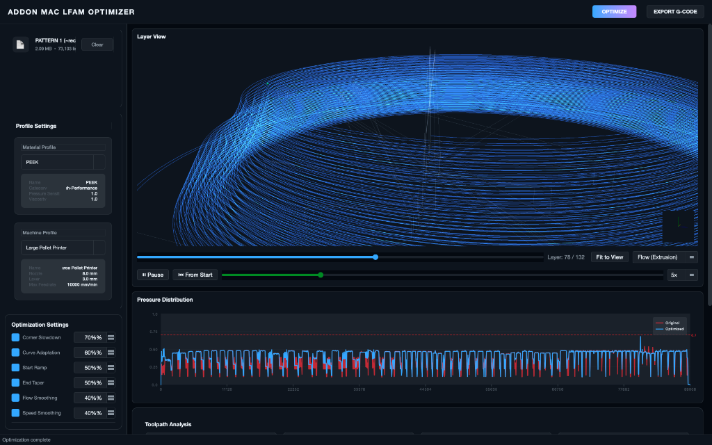

# LFAM Optimizer

**Large Format Additive Manufacturing (LFAM) G-code Optimizer**

LFAM Optimizer is a high-performance, PyQt6-based desktop application designed to analyze and optimize G-code toolpaths specifically for Large Format Additive Manufacturing (pellet extrusion, concrete printing, etc.). 

Traditional desktop 3D printing slicers assume the extruder can instantly stop and start the flow of plastic. However, in LFAM systems with large single-screw pellet extruders, the immense melt pool creates significant lag. This leads to severe over-extrusion on sharp corners and under-extrusion on acceleration. 

The **LFAM Optimizer** solves this by simulating the extruder's internal pressure using a **Virtual Pressure Index (VPI)** and automatically adjusting feedrates and extrusion multipliers dynamically throughout the print.



## 🚀 Features

- **High-Performance Core Engine**: Custom memory-optimized G-code parser capable of analyzing massive 100,000+ line industrial G-code files in seconds.
- **Virtual Pressure Engine**: Computes a continuous Volumetric Pressure Index (VPI) across toolpaths based on 8 customizable factors:
  - Flow rate & Velocity
  - Corner angles & Curve radii
  - Acceleration & Start/Stop history
  - Segment density
- **Interactive 3D Visualization**: A full OpenGL-powered (`pyqtgraph`) 3D canvas that visualizes toolpaths layer-by-layer. Includes dynamic color heatmaps mapping exact areas of high pressure, speed, and flow.
- **Dynamic Optimization**: Automatically modifies the original G-code to implement corner slowdowns, curve adaptations, and smooth S-curve flow ramping.
- **Profile Management**: Built-in editors to create, tune, and persistently save specific Material profiles (viscosity, melt flow index) and Machine profiles (kinematic limits, nozzle diameter).

## 🛠️ Installation

### Prerequisites
- Python 3.9 or newer
- macOS, Linux, or Windows

### Setup
1. Clone the repository:
   ```bash
   git clone https://github.com/yourusername/lfam-optimizer.git
   cd lfam-optimizer
   ```

2. Create a virtual environment:
   ```bash
   python3 -m venv venv
   source venv/bin/activate  # On Windows: venv\Scripts\activate
   ```

3. Install the dependencies:
   ```bash
   pip install -r requirements.txt
   ```

4. Launch the application:
   ```bash
   python main.py
   ```

## 📂 Project Structure

```text
lfam-optimizer/
├── main.py                     # Application entry point
├── requirements.txt            # Python dependencies
├── src/
│   ├── engine/                 # Core Optimization Engine
│   │   ├── analysis/           # Geometry & path analysis algorithms
│   │   ├── emitter/            # G-code reconstruction
│   │   ├── optimizer/          # Path modification strategies (ramping, smoothing)
│   │   ├── parser/             # Memory-optimized G-code parsing
│   │   └── pressure/           # Virtual Pressure model math
│   ├── profiles/               # Configurable JSON profiles
│   │   ├── machines/           # Machine hardware limits
│   │   └── materials/          # Polymer rheology profiles
│   └── ui/                     # PyQt6 User Interface
│       ├── widgets/            # Custom UI components, editors, 3D Canvas
│       ├── main_window.py      # Primary window and layout
│       └── theme.py            # Global color palette and styling
```

## 🧠 How the Engine Works

1. **Parsing**: The `GCodeParser` reads raw `.gcode` and translates it into memory-efficient `Move` objects (bypassing heavy Python dictionary overheads).
2. **Analysis**: The `GeometryAnalyzer` calculates vectors, deflection angles, and circumradii to understand the shape of the toolpath.
3. **Pressure Simulation**: The `VirtualPressureEngine` evaluates the material properties against the geometry to predict where the extruder will build up too much backpressure.
4. **Optimization**: The `PressureOptimizer` injects speed adjustments and flow ramps exactly where the pressure hotspots are detected.
5. **Emission**: The `GCodeEmitter` writes the modified commands back into a clean, ready-to-print G-code file.

## 🤝 Contributing
Contributions, issues, and feature requests are welcome! Feel free to check the issues page.

## 📝 License
This project is licensed under the MIT License - see the LICENSE file for details.
